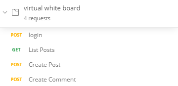

# Hand in

This is my Hand in for the CIC-HIRING-TEST.
I have chosen to implement the virtual white board.
My focus while implementing the virtual white board was on test driven development. This means I spent most of my time of my time creating test.
Below is the list of user stories I managed to implement.

### Login

- [x] Sam and Bertha wants to use the virtual whiteboard, to do this they must first login with the team given login
- [ ] Sam and Bertha are sick and tired of random people deleting their posts, they want their own logins and to only be able to delete their own posts
- [ ] Sam has forgotten his password and would like to reset it

### Virtual board

- [x] Sam wants to create a new piece of text to put onto the virtual board so that he can write a motivational text, he wants it to be as long as a tweet
- [ ] Bertha would like to be able to put links to images onto the board
- [ ] Bertha would love if she could post a youtube video that she saw last week
- [ ] Bertha would like to see media be rendered on the board
- [ ] Sam wants to delete a post he's created, the youtube video was not as fun as he remembered it
- [x] Bertha would like to be able to put a comment on posts so that Sam can see that she's seen the post
- [ ] Bertha would like to be able to "like" a post
- [ ] Bertha's lunch has been stolen from the fridge and would like to put an anonymous post up that tells the thief off

### Role management

- [ ] Sam would like to become a moderator for the virtual board to make sure that bad stuff is not posted, when he is a moderator he can delete all posts
- [ ] Sam would like to add Jennifer as a new user of the whiteboard and give her a login

### Account management

- [ ] Sam does not like his name on the whiteboard and would like to change it to "Sam Wise"
- [ ] Sam would like to be able to change his password, Bertha keeps logging in and posting for him

## How to run with Docker

To run the Virtual white board with [Docker](https://www.docker.com/):

From root folder type `docker-compose up` to compose up and build docker images.

## Postman colleciton

I have exported a postman collection that has the working functionality.
When using the collection remember to call Login first and save the token that is returned. This token is needed for the other endpoints

